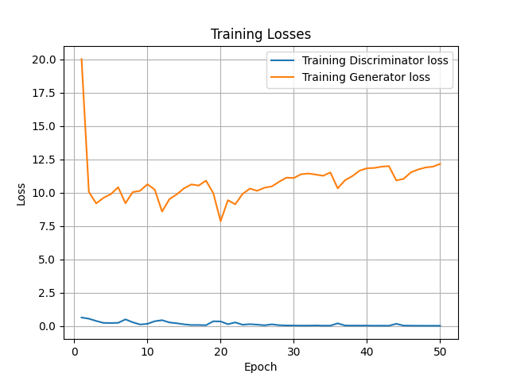
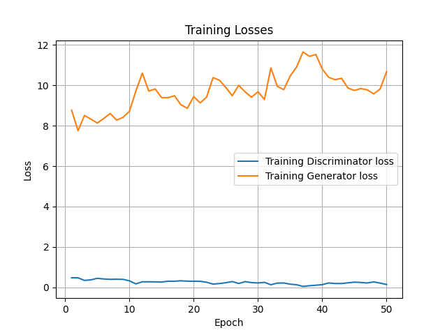
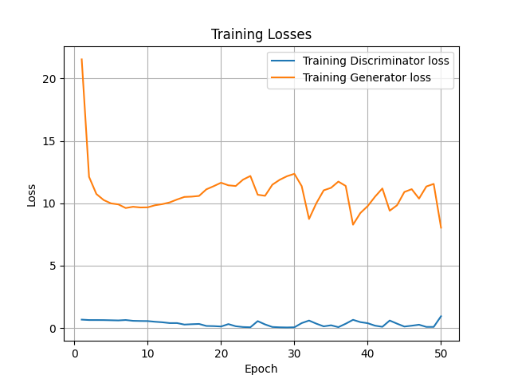
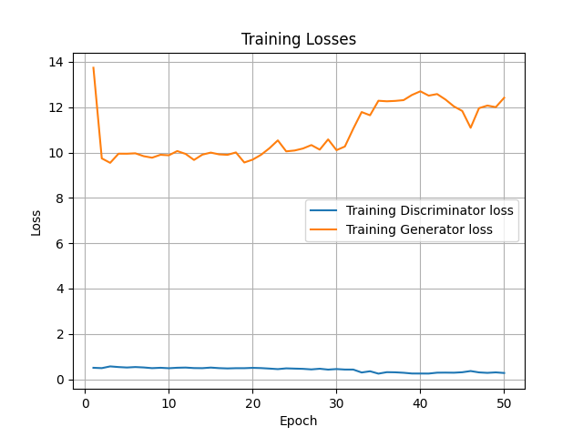

# Training results
Here, you can find the directories that contain both training configurations and training logs of each run. The content of each directory is as follows:
```
.
├── results_generate_AB_50_epochs
│   ├── __results___files
│   │   ├── ...
│   ├── config.json
│   ├── generated_images
│   │   ├── pred_batch_1.png
│   │   ├── ...
│   ├── training_logs.csv
│   └── training_losses.png
├── results_generate_AB_50_epochs_resnet
│   ├── __results___files
│   │   ├── ...
│   ├── config.json
│   ├── generated_images
│   │   ├── pred_batch_1.png
│   │   ├── ...
│   ├── training_logs.csv
│   └── training_losses.png
├── results_generate_RGB_50_epochs_resnet
│   ├── ...
└── results_generate_RGB_50epochs
    ├── ...
```

Each directory has a folder `generated images/`, which contains predictions of a generator model on some validation images at each epoch. In total, there are 50 epochs. `training_logs.csv` is a CSV file with 50 rows (one for each epoch) that stores all loss values of both discriminator and generator. For a better understanding of loss values, the graphs have been plotted and saved as `training_losses.png` files. These loss graphs are displayed below.

## Generate AB


## Generate AB with ResNet backbone


## Generate RGB


## Generate RGB with ResNet backbone

